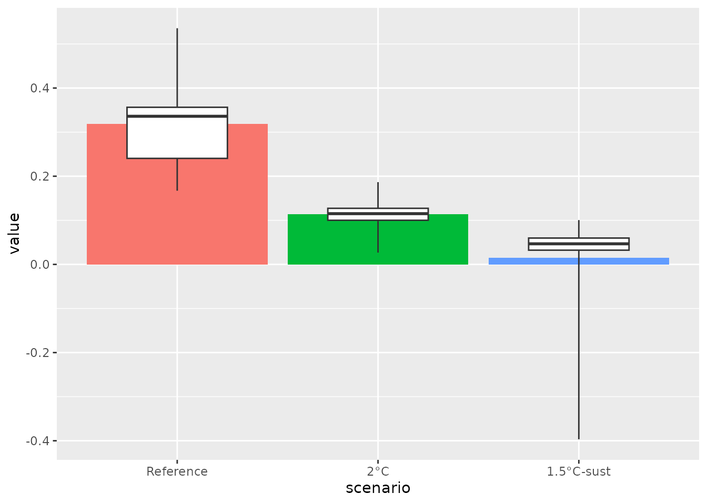
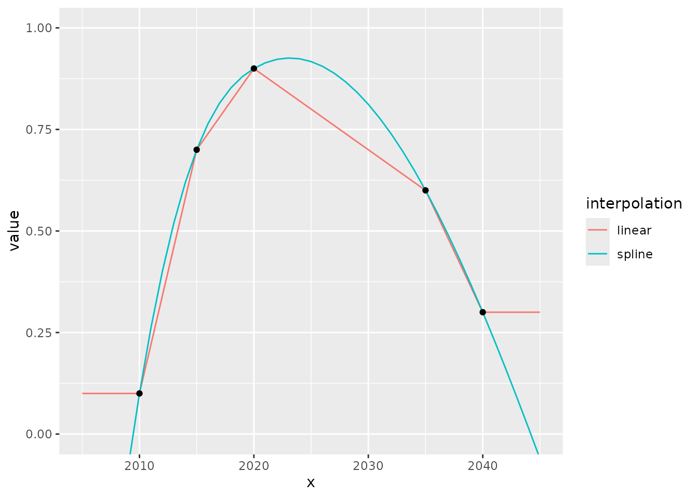
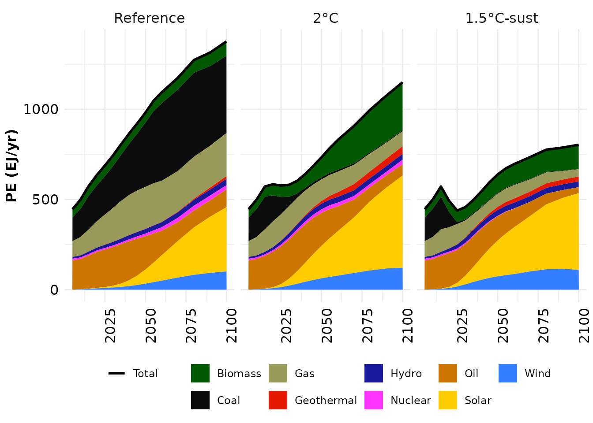
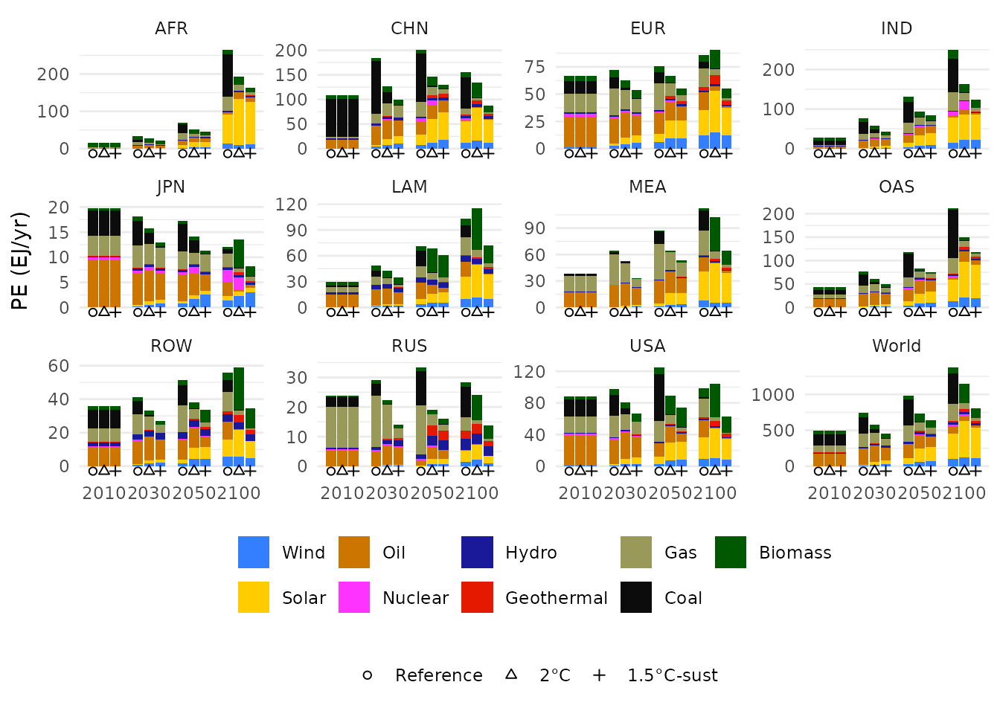

# REMIND/IAM Data Analysis Using quitte

The `quitte` package is a grab-bag of utility functions to work with
REMIND/IAM results (or any kind of data) in a `.mif`-like format. It
builds on the capabilities of the `dplyr`, `tidyr`, and `ggplot2`
packages.

## Load required packages

``` r
library(tidyverse)
library(quitte)
```

Generally, when working with quitte, you will need the `dplyr` and
`tidyr` packages. `tidyverse` is a “collection” package loading these
two, as well as the `ggplot2` package and a couple of others.

## Data Wrangling

As `quitte` builds on the capabilities and practices of the *tidy data*
packages, it is highly recommended to read [this excellent tutorial
introducing `dplyr` and
`tidyr`](https://datacarpentry.org/R-ecology-lesson/03-dplyr.html). You
should be comfortable with the concept of piping (`%>%`), as well as the
[`filter()`](https://dplyr.tidyverse.org/reference/filter.html),
[`select()`](https://dplyr.tidyverse.org/reference/select.html),
[`group_by()`](https://dplyr.tidyverse.org/reference/group_by.html),
[`mutate()`](https://dplyr.tidyverse.org/reference/mutate.html), and
[`summarise()`](https://dplyr.tidyverse.org/reference/summarise.html)
functions. Understanding the join functions (especially
[`inner_join()`](https://dplyr.tidyverse.org/reference/mutate-joins.html)
and
[`full_join()`](https://dplyr.tidyverse.org/reference/mutate-joins.html)
will help immensely).

## Load Data

> **Note:** We first load some example data for following along with the
> sections below. If anything is unclear, just keep reading, it will be
> explained further down.

[`read.quitte()`](../reference/read.quitte.md) reads `.mif`-files and
converts them into five-dimensional long format data frames with columns
`model`, `scenario`, `region`, `variable`/`unit`, `period`, and `value`.

First, select all the `.mif` files you want to load:

``` r
base.path <- 'some/directory/'

data.files <- c(
    'REMIND_generic_r7552c_1p5C_Def-rem-5.mif',
    'REMIND_generic_r7552c_1p5C_UBA_Sust-rem-5.mif',
    'REMIND_generic_r7552c_2C_Def-rem-5.mif',
    'REMIND_generic_r7552c_2C_UBA_Sustlife-rem-5.mif',
    'REMIND_generic_r7552c_REF_Def05-rem-5.mif',
    # 'REMIND_generic_r7552c_REF_Def05-rem-5_tab.mif',
    NULL)
```

> **Tip!** Keep your data input formatted in a way that is easy to read
> and to modify. Separate the directory from the path if there are many
> files in the same directory. Having each path (or other item) on a
> separate line (and ending with `NULL`) makes it easy to comment out
> individual files during development or debugging.

Then load all the files:

``` r
data <- read.quitte(file.path(base.path, data.files))
```

, we can also load it like this: This is what you will do normally.
Since the example data is included with the `quitte` package as a data
object in case you just want to try something or give an example for
something, we can also load it like this:

``` r
(data <- quitte_example_data)
#> # A tibble: 19,152 × 7
#>    model  scenario              region variable    unit    period value
#>    <fct>  <fct>                 <fct>  <fct>       <fct>    <int> <dbl>
#>  1 REMIND r7552c_1p5C_Def-rem-5 AFR    Consumption billio…   2005  618.
#>  2 REMIND r7552c_1p5C_Def-rem-5 AFR    Consumption billio…   2010  735.
#>  3 REMIND r7552c_1p5C_Def-rem-5 AFR    Consumption billio…   2015  978.
#>  4 REMIND r7552c_1p5C_Def-rem-5 AFR    Consumption billio…   2020  990.
#>  5 REMIND r7552c_1p5C_Def-rem-5 AFR    Consumption billio…   2025 1248.
#>  6 REMIND r7552c_1p5C_Def-rem-5 AFR    Consumption billio…   2030 1555.
#>  7 REMIND r7552c_1p5C_Def-rem-5 AFR    Consumption billio…   2035 1900.
#>  8 REMIND r7552c_1p5C_Def-rem-5 AFR    Consumption billio…   2040 2284.
#>  9 REMIND r7552c_1p5C_Def-rem-5 AFR    Consumption billio…   2045 2703.
#> 10 REMIND r7552c_1p5C_Def-rem-5 AFR    Consumption billio…   2050 3185.
#> # ℹ 19,142 more rows
```

## Trim Data

If you know which data you will need you can trim down the data frame
early, reducing memory needs and increasing processing speed.

[`inline.data.frame()`](../reference/inline.data.frame.md) is a wrapper
function for entering tabular data in an easy-to-read fashion.

``` r
scenarios <- inline.data.frame(
    'scenario;                       scen.name',
    'r7552c_REF_Def05-rem-5;         Reference',
    # 'r7552c_1p5C_Def-rem-5;          1.5°C-def',
    'r7552c_2C_Def-rem-5;            2°C',
    'r7552c_1p5C_UBA_Sust-rem-5;     1.5°C-sust',
    # 'r7552c_2C_UBA_Sustlife-rem-5;   2°C-sust',
    NULL)

tmax <- 2100
```

``` r
data <- data %>%
    filter(scenario %in% scenarios$scenario,
           tmax >= period)
```

## Use Pretty Names

[`replace_column()`](../reference/replace_column.md) can be used to
replace a column with hard-to-read or ugly entries with more pleasant
ones. This is quite useful for preparing data for plots or tables.

[`order.levels()`](../reference/order.levels.md) arranges factor levels
(e.g. scenario names) in a specific order, thus controlling the order
with which items appear in plots.

``` r
(data <- data %>%
    replace_column(scenarios, scenario, scen.name) %>%
     order.levels(scenario = scenarios$scen.name))
#> # A tibble: 9,600 × 7
#>    model  scenario   region variable    unit               period value
#>    <fct>  <fct>      <fct>  <fct>       <fct>               <int> <dbl>
#>  1 REMIND 1.5°C-sust AFR    Consumption billion US$2005/yr   2005  618.
#>  2 REMIND 1.5°C-sust AFR    Consumption billion US$2005/yr   2010  735.
#>  3 REMIND 1.5°C-sust AFR    Consumption billion US$2005/yr   2015  978.
#>  4 REMIND 1.5°C-sust AFR    Consumption billion US$2005/yr   2020 1223.
#>  5 REMIND 1.5°C-sust AFR    Consumption billion US$2005/yr   2025 1532.
#>  6 REMIND 1.5°C-sust AFR    Consumption billion US$2005/yr   2030 1923.
#>  7 REMIND 1.5°C-sust AFR    Consumption billion US$2005/yr   2035 2365.
#>  8 REMIND 1.5°C-sust AFR    Consumption billion US$2005/yr   2040 2869.
#>  9 REMIND 1.5°C-sust AFR    Consumption billion US$2005/yr   2045 3427.
#> 10 REMIND 1.5°C-sust AFR    Consumption billion US$2005/yr   2050 4048.
#> # ℹ 9,590 more rows
```

### Piping

The pipe operator `%>%` is a shortcut to string any number of operations
together. So instead of writing a long code worm like

``` r
ungroup(mutate(group_by(select(filter(data, 'Reference' == scenario), region, period, value), region), value = cumsum(value)))
```

that you would have to read from the inside out, you can write each
function call on a separate line, greatly improving readability as data
“flows” from top to bottom, each function being applied in succession.

``` r
data %>%
    filter('Reference' == scenario) %>%
    select(region, period, value) %>%
    group_by(region) %>%
    mutate(value = cumsum(value)) %>%
    ungroup()
```

### Filtering

[`filter()`](https://dplyr.tidyverse.org/reference/filter.html) is a
more useful and versatile variant of the data frame extraction operator
`[`. Instead of

``` r
data[data$period == 2030 & df$scenario != 'Reference',]
```

use

``` r
data %>%
    filter(period == 2030,
           scenario != 'Reference')
```

again, improving readability and decreasing proneness to error.
Predicates (the test) are combined via logical AND, you can use as many
of them as you want, and there are lots of helper functions available in
the `dplyr` package.

### Selecting

[`select()`](https://dplyr.tidyverse.org/reference/select.html) selects
columns from a data frame. So if you only need columns `scenario` and
`region`, do

``` r
data %>%
    select(scenario, region)
```

If you need all but `model`, do

``` r
data %>%
    select(-model)
```

You can rename columns on the way

``` r
data %>%
    select(scenario, year = period)
```

### Grouping

[`group_by()`](https://dplyr.tidyverse.org/reference/group_by.html)
subdivides a data frame into groups, such that so-called *window*
functions operate only on the items within a group. If you, for example,
want to calculate the cumulated energy production over time for
different scenarios and regions, you need to group by those dimensions
first.

``` r
data %>%
    filter(variable == 'PE') %>%
    group_by(scenario, region) %>%
    mutate(value = cumsum(value)) %>%
    ungroup()
```

### Mutating

[`mutate()`](https://dplyr.tidyverse.org/reference/mutate.html) is the
low-level function for modifying existing or creating new columns. Its
output has the same number of rows as its input.

``` r
data %>%
    filter(variable == 'PE') %>%
    group_by(scenario, region) %>%
    mutate(value = cumsum(value)) %>%
    ungroup()
```

### Summarising

[`summarise()`](https://dplyr.tidyverse.org/reference/summarise.html) is
the low-level function for aggregating variables. Its output has *one*
row for every group. All ungrouped columns are dropped.

``` r
data %>%
    group_by(scenario) %>%
    summarise(value = mean(value)) %>%
    ungroup()
```

## Sum Things Up

[`sum_total()`](../reference/sum_total.md) sums values up across regions

``` r
data %>%
    filter(scenario == 'Reference',
           variable == 'Consumption',
           period == 2050,
           region %in% c('CHN', 'IND', 'JPN', 'OAS')) %>%
    sum_total(group = region, name = 'all Asia')
#> # A tibble: 5 × 7
#>   model  scenario  region   variable    unit              period  value
#>   <fct>  <fct>     <fct>    <fct>       <fct>              <int>  <dbl>
#> 1 REMIND Reference CHN      Consumption billion US$2005/…   2050  7912.
#> 2 REMIND Reference IND      Consumption billion US$2005/…   2050  4229.
#> 3 REMIND Reference JPN      Consumption billion US$2005/…   2050  5737.
#> 4 REMIND Reference OAS      Consumption billion US$2005/…   2050  6745.
#> 5 REMIND Reference all Asia Consumption billion US$2005/…   2050 24623.
```

or across other dimensions

``` r
data %>%
    filter(scenario == '2°C',
           region == 'RUS',
           period == 2035,
           variable %in% paste0('SE|Heat|', c('Coal', 'Gas'))) %>%
    sum_total(variable, name = 'SE|Heat|fossil')
#> # A tibble: 3 × 7
#>   model  scenario region variable       unit  period  value
#>   <fct>  <fct>    <fct>  <fct>          <fct>  <int>  <dbl>
#> 1 REMIND 2°C      RUS    SE|Heat|Coal   EJ/yr   2035 0.0413
#> 2 REMIND 2°C      RUS    SE|Heat|Gas    EJ/yr   2035 1.43  
#> 3 REMIND 2°C      RUS    SE|Heat|fossil EJ/yr   2035 1.47
```

## Add New Variables

[`calc_addVariable()`](../reference/calc_addVariable.md) calculates new
variables from existing ones, using generic formulas. Variable names
that are not valid R identifiers – basically everything inside a
`.mif`-file, need to be escaped using backticks (“\`”).

``` r
data %>%
    filter(region == 'EUR',
           period == 2025,
           variable %in% c('PE', 'Population')) %>%
    calc_addVariable(
        # EJ/yr / million / (3.6e-9 EJ/MWh) * 1e6 1/million = MWh/yr
        '`PE per capita`' = 'PE / Population / 3.6e-3',
        units = 'MWh/year')
#> # A tibble: 9 × 7
#>   model  scenario   region variable      unit     period value
#>   <fct>  <fct>      <fct>  <fct>         <fct>     <int> <dbl>
#> 1 REMIND 1.5°C-sust EUR    Population    million    2025 521. 
#> 2 REMIND 1.5°C-sust EUR    PE            EJ/yr      2025  54.7
#> 3 REMIND 2°C        EUR    Population    million    2025 521. 
#> 4 REMIND 2°C        EUR    PE            EJ/yr      2025  64.5
#> 5 REMIND Reference  EUR    Population    million    2025 521. 
#> 6 REMIND Reference  EUR    PE            EJ/yr      2025  70.3
#> 7 REMIND 1.5°C-sust EUR    PE per capita MWh/year   2025  29.2
#> 8 REMIND 2°C        EUR    PE per capita MWh/year   2025  34.4
#> 9 REMIND Reference  EUR    PE per capita MWh/year   2025  37.5
```

> **Tip!** Note down all unit conversions you do where you do them, and
> include the calculation. This will save you hours of debug-time in the
> future. (Trust me.)

It is also possible to only keep the newly calculated values for further
manipulation, by settting `only.new = TRUE`.

``` r
data %>%
    filter(region == 'OAS',
           period == 2070,
           scenario != 'Reference') %>%
    calc_addVariable(
        # EJ/yr / $bn/yr * 1e-15 kJ/EJ * 1e9 $/$bn = kJ/$
        '`PE|Coal|GDP intensity`'       = '`PE|Coal`       / `GDP|PPP` * 1e6',
        '`PE|Oil|GDP intensity`'        = '`PE|Oil`        / `GDP|PPP` * 1e6',
        '`PE|Gas|GDP intensity`'        = '`PE|Gas`        / `GDP|PPP` * 1e6',
        '`PE|Nuclear|GDP intensity`'    = '`PE|Nuclear`    / `GDP|PPP` * 1e6',
        '`PE|Biomass|GDP intensity`'    = '`PE|Biomass`    / `GDP|PPP` * 1e6',
        '`PE|Hydro|GDP intensity`'      = '`PE|Hydro`      / `GDP|PPP` * 1e6',
        '`PE|Geothermal|GDP intensity`' = '`PE|Geothermal` / `GDP|PPP` * 1e6',
        '`PE|Wind|GDP intensity`'       = '`PE|Wind`       / `GDP|PPP` * 1e6',
        '`PE|Solar|GDP intensity`'      = '`PE|Solar`      / `GDP|PPP` * 1e6',
        units = 'kJ/$',
        only.new = TRUE)
#> # A tibble: 18 × 7
#>    model  scenario   region variable                unit  period  value
#>    <fct>  <fct>      <fct>  <fct>                   <fct>  <int>  <dbl>
#>  1 REMIND 1.5°C-sust OAS    PE|Coal|GDP intensity   kJ/$    2070   13.7
#>  2 REMIND 2°C        OAS    PE|Coal|GDP intensity   kJ/$    2070   26.8
#>  3 REMIND 1.5°C-sust OAS    PE|Oil|GDP intensity    kJ/$    2070  447. 
#>  4 REMIND 2°C        OAS    PE|Oil|GDP intensity    kJ/$    2070  600. 
#>  5 REMIND 1.5°C-sust OAS    PE|Gas|GDP intensity    kJ/$    2070  258. 
#>  6 REMIND 2°C        OAS    PE|Gas|GDP intensity    kJ/$    2070  454. 
#>  7 REMIND 1.5°C-sust OAS    PE|Nuclear|GDP intensi… kJ/$    2070    0  
#>  8 REMIND 2°C        OAS    PE|Nuclear|GDP intensi… kJ/$    2070   91.4
#>  9 REMIND 1.5°C-sust OAS    PE|Biomass|GDP intensi… kJ/$    2070   64.5
#> 10 REMIND 2°C        OAS    PE|Biomass|GDP intensi… kJ/$    2070   95.6
#> 11 REMIND 1.5°C-sust OAS    PE|Hydro|GDP intensity  kJ/$    2070   75.0
#> 12 REMIND 2°C        OAS    PE|Hydro|GDP intensity  kJ/$    2070   74.8
#> 13 REMIND 1.5°C-sust OAS    PE|Geothermal|GDP inte… kJ/$    2070   66.6
#> 14 REMIND 2°C        OAS    PE|Geothermal|GDP inte… kJ/$    2070   72.9
#> 15 REMIND 1.5°C-sust OAS    PE|Wind|GDP intensity   kJ/$    2070  373. 
#> 16 REMIND 2°C        OAS    PE|Wind|GDP intensity   kJ/$    2070  305. 
#> 17 REMIND 1.5°C-sust OAS    PE|Solar|GDP intensity  kJ/$    2070 1132. 
#> 18 REMIND 2°C        OAS    PE|Solar|GDP intensity  kJ/$    2070  943.
```

[`calc_growthrate()`](../reference/calc_growthrate.md) calculates the
growth rate (in `%/yr`) of a time series, appending `[Growth Rate]` to
the variable name:

    data %>%
        calc_growthrate(only.new = TRUE, filter.function = "Consumption")

returns a data.frame with the variable `Consumption [Growth Rate]`.
`filter.function` can be a vector of variable names or a function that
filters `data`.

## Net Present Value of a Time Series

[`calcCumulatedDiscount()`](../reference/calcCumulatedDiscount.md)
calculates the net present value of a time series.

``` r
data %>%
    filter(scenario != 'Reference',
           region == 'World') %>%
    calcCumulatedDiscount(nameVar = 'Policy Cost|Consumption Loss') %>%
    select(-model, -region, -unit) %>%
    pivot_wider(names_from = 'scenario')
#> # A tibble: 16 × 4
#>    variable                                period  `2°C` `1.5°C-sust`
#>    <fct>                                    <int>  <dbl>        <dbl>
#>  1 Policy Cost|Consumption Loss|aggregated   2005    0             0 
#>  2 Policy Cost|Consumption Loss|aggregated   2010    0             0 
#>  3 Policy Cost|Consumption Loss|aggregated   2015    0             0 
#>  4 Policy Cost|Consumption Loss|aggregated   2020 -163.         -374.
#>  5 Policy Cost|Consumption Loss|aggregated   2025 -293.         -246.
#>  6 Policy Cost|Consumption Loss|aggregated   2030  -77.9         821.
#>  7 Policy Cost|Consumption Loss|aggregated   2035  429.         2005.
#>  8 Policy Cost|Consumption Loss|aggregated   2040 1106.         2927.
#>  9 Policy Cost|Consumption Loss|aggregated   2045 1799.         3449.
#> 10 Policy Cost|Consumption Loss|aggregated   2050 2438.         3564.
#> 11 Policy Cost|Consumption Loss|aggregated   2055 3097.         3511.
#> 12 Policy Cost|Consumption Loss|aggregated   2060 3863.         3481.
#> 13 Policy Cost|Consumption Loss|aggregated   2070 5537.         3504.
#> 14 Policy Cost|Consumption Loss|aggregated   2080 7141.         3481.
#> 15 Policy Cost|Consumption Loss|aggregated   2090 8436.         3310.
#> 16 Policy Cost|Consumption Loss|aggregated   2100 9324.         3026.
```

## Calculate Sample Quantiles

[`calc_quantiles()`](../reference/calc_quantiles.md) makes it easy to
produce sample quantiles corresponding given probabilities from data
frames.

``` r
(data.plot <- data %>%
    filter(region != 'World',
           period == 2040) %>%
    calc_addVariable(
        # MtCO2/$bn * 1e9 kg/Mt * 1e-9 $/$bn = kgCO2/$
        '`CO2 intensity`' = '`Emi|CO2` / `GDP|PPP`',
        units = 'kGCO2/US$2005',
        only.new = TRUE) %>%
    group_by(model, scenario, variable, unit, period) %>%
    calc_quantiles() %>%
    pivot_wider(names_from = 'quantile'))
#> # A tibble: 3 × 10
#> # Groups:   model, scenario, variable, unit, period [3]
#>   model  scenario   variable  unit  period      q0    q25    q50    q75
#>   <fct>  <fct>      <fct>     <fct>  <int>   <dbl>  <dbl>  <dbl>  <dbl>
#> 1 REMIND 1.5°C-sust CO2 inte… kGCO…   2040 -0.397  0.0323 0.0467 0.0598
#> 2 REMIND 2°C        CO2 inte… kGCO…   2040  0.0267 0.100  0.115  0.127 
#> 3 REMIND Reference  CO2 inte… kGCO…   2040  0.167  0.240  0.336  0.356 
#> # ℹ 1 more variable: q100 <dbl>
```

This is quite useful for plotting uncertainty ranges.

``` r
ggplot() +
    geom_col(
        data = data %>%
            filter(region == 'World',
                   period == 2040) %>%
            calc_addVariable(
                # MtCO2/$bn * 1e9 kg/Mt * 1e-9 $/$bn = kgCO2/$
                '`CO2 intensity`' = '`Emi|CO2` / `GDP|PPP`',
                units = 'kGCO2/US$2005',
                only.new = TRUE),
        mapping = aes(x = scenario, y = value, fill = scenario)) +
    scale_fill_discrete(guide = 'none') +
    geom_boxplot(
        data = data.plot,
        mapping = aes(
            x = scenario,
            ymin = q0, lower = q25, middle = q50, upper = q75, ymax = q100),
        stat = 'identity',
        width = 0.5)
```



It can also be done for arbitrary quantiles

``` r
data %>%
    filter(region == 'World',
           period == 2040) %>%
    calc_addVariable(
        # MtCO2/$bn * 1e9 kg/Mt * 1e-9 $/$bn = kgCO2/$
        '`CO2 intensity`' = '`Emi|CO2` / `GDP|PPP`',
        units = 'kGCO2/US$2005',
        only.new = TRUE) %>%
    group_by(model, scenario, variable, unit, period) %>%
    calc_quantiles(probs = c(low = 1/3, high = 2/3, 'very high' = 4/5)) %>%
    pivot_wider(names_from = 'quantile')
#> # A tibble: 3 × 8
#> # Groups:   model, scenario, variable, unit, period [3]
#>   model  scenario   variable     unit  period    low   high `very high`
#>   <fct>  <fct>      <fct>        <fct>  <int>  <dbl>  <dbl>       <dbl>
#> 1 REMIND 1.5°C-sust CO2 intensi… kGCO…   2040 0.0154 0.0154      0.0154
#> 2 REMIND 2°C        CO2 intensi… kGCO…   2040 0.114  0.114       0.114 
#> 3 REMIND Reference  CO2 intensi… kGCO…   2040 0.319  0.319       0.319
```

## Interpolate Missing Periods

[`interpolate_missing_periods()`](../reference/interpolate_missing_periods.md)
adds missing periods to a data frame and interpolates missing values. It
uses either *linear* or *spline* interpolation and can extend missing
data before/after the first/last period in the original data.

``` r
data.example <- tribble(
    ~x,   ~value,
    2010,    0.1,
    2015,    0.7,
    2020,    0.9,
    2035,    0.6,
    2040,    0.3)

data.plot <- bind_rows(
    data.example %>%
        interpolate_missing_periods(
            x = seq(2005, 2045, 1), expand.values = TRUE,
            method = 'linear') %>%
        rename(linear = value) %>%
        gather(interpolation, value, -x),

    data.example %>% 
        interpolate_missing_periods(
            x = seq(2005, 2045, 1), expand.values = TRUE, method = 'spline') %>%
        rename(spline = value) %>%
        gather(interpolation, value, -x)
)
#> Warning in interpolate_missing_periods_(data, periods, value,
#> expand.values, : Expanded values of spline interpolation beyond
#> original data range. Results may be nonsensical.
```

Be careful when using this, as the results may be nonsensical.

``` r
ggplot(mapping = aes(x = x, y = value)) +
    geom_line(data = data.plot, mapping = aes(colour = interpolation)) +
    geom_point(data = data.example) +
    coord_cartesian(ylim = c(0, 1))
```



In this case, values below 0 might be meaningless. So use spline
extensions with care.

## Plotting with `mip`

Data in `quitte` format is easily passed to the plot functions in the
`mip` package.

``` r
data %>%
    filter('World' == region,
           grepl('^PE\\|', variable)) %>%
    mip::mipArea(x = .) +
    facet_wrap(~ scenario)
```



``` r
data %>%
    filter(period %in% c(2010, 2030, 2050, 2100),
           grepl('^PE\\|', variable)) %>%
    mip::mipBarYearData(x = .) +
    facet_wrap(~ region, scales = 'free_y')
```



> **Note:** You don’t have to call the `mip`-functions via the double
> colon (`::`) operator, but would load the package instead with
> [`library(mip)`](https://github.com/pik-piam/mip). This is only needed
> in this vignette, since `quitte` can’t import the `mip` package.)

## Plotting ‘correct’ Bars

If bar plots are used naively (as in: without extra care), the bars for
periods after 2055 are too narrow and either in the wrong places

``` r
colours_PE <- c('Coal'       = '#0C0C0C',
                'Oil'        = '#663A00',
                'Gas'        = '#E5E5B2',
                'Nuclear'    = '#FF33FF',
                'Hydro'      = '#191999',
                'Biomass'    = '#005900',
                'Geothermal' = '#E51900',
                'Wind'       = '#337FFF',
                'Solar'      = '#FFCC00')

data_plot <- quitte_example_data %>%
            filter('r7552c_1p5C_Def-rem-5' == scenario,
                   'EUR' == region,
                   grepl('^PE\\|', variable),
                   2100 >= period) %>%
            mutate(variable = sub('^PE\\|', '', variable)) %>%
            order.levels(variable = rev(names(colours_PE)))
```

``` r
ggplot() +
    geom_col(
        data = data_plot,
        mapping = aes(x = factor(period), y = value, fill = variable)) +
    scale_fill_manual(values = colours_PE,
                      name = NULL) +
    labs(x = NULL, y = 'EJ/yr')
```


or spread out with large gaps in between.

``` r
ggplot() +
    geom_col(
        data = data_plot,
        mapping = aes(x = period, y = value, fill = variable)) +
    scale_fill_manual(values = colours_PE,
                      name = NULL) +
    scale_x_continuous(breaks = unique(data_plot$period),
                       name = NULL) +
    labs(y = 'EJ/yr')
```


In both cases, the visual representation of the data is distorted, since
the are of the bars should correspond to the integral of the variable
over time. (3 EJ over 10 years should result in a bar with twice the
area than 3 EJ over 5 years.)

To correct this, you can use the function
`add_remind_timesteps_columns`, that adds two columns to the data frame,
`xpos` and `width`, which can be used to create a ‘correct’ bar plot:

``` r
ggplot() +
    geom_col(
        data = data_plot %>%
            add_remind_timesteps_columns(gaps = 0.1),
        mapping = aes(x = xpos, width = width, y = value, fill = variable)) +
    scale_fill_manual(values = colours_PE,
                      name = NULL) +
    scale_x_continuous(breaks = unique(data_plot$period),
                       name = NULL) +
    labs(y = 'EJ/yr')
```


This is also available through the utility function
`ggplot_bar_remind_vts`:

``` r
periods <- unique(data_plot$period)
periods <- periods[which(!periods %% 10)]

ggplot_bar_remind_vts(data_plot) +
    scale_fill_manual(values = colours_PE, name = NULL) +
    scale_x_continuous(breaks = periods, name = NULL) +
    labs(y = 'EJ/yr')
```


